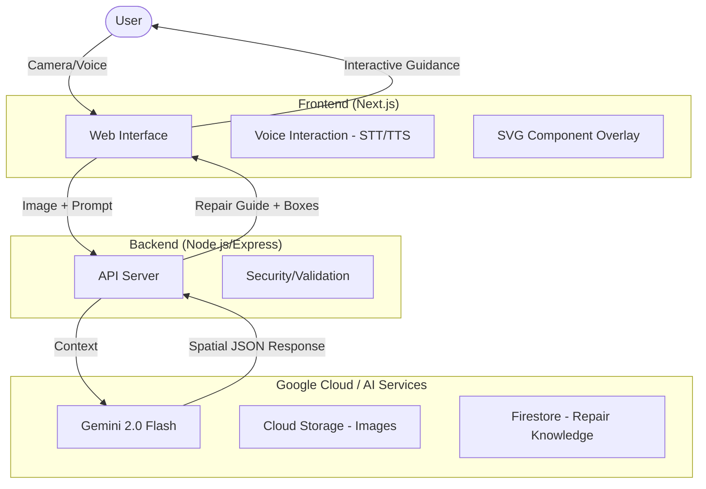

# RepairMate AI - System Architecture

RepairMate AI is a production-level multimodal AI agent system designed for the Gemini Live Agent Challenge. It leverages Google's Gemini 2.0 Flash model to provide real-time electronics diagnostics and repair guidance.

## 🏗 System Diagram

## 🛠 Tech Stack

- **Frontend:** Next.js (App Router), Tailwind CSS, Framer Motion, Lucide React, Web Speech API.
- **Backend:** Node.js, Express, TypeScript.
- **AI Model:** Google Gemini 2.0 Flash (Multimodal + Spatial Analysis).
- **Deployment:** Vercel (Frontend), Google Cloud Run (Backend).

## 🔄 Agent Workflow

1.  **Scanning Mode:** User captures or uploads an image of a broken device.
2.  **Multimodal Analysis:** The backend sends the image and a specialized system instruction to Gemini 2.0 Flash.
3.  **Spatial Reasoning:** Gemini identifies components and faults, returning normalized bounding box coordinates.
4.  **Repair Generation:** Gemini generates a structured JSON response containing:
    - Detected components with bounding boxes.
    - Fault identification and likelihood.
    - Safety warnings and required tools.
    - Step-by-step repair protocol.
    - Sustainability impact (e-waste/carbon savings).
5.  **Interactive Assistant:** The user follows the visual guide and can ask follow-up questions via text or voice. The assistant maintains context of the repair session.

## 🛡 Safety & Reliability

- **Electrical Hazard Detection:** The system specifically looks for exposed wires and high-voltage components.
- **Confidence Scoring:** Every diagnosis includes an AI confidence score.
- **Pro-Technician Recommendations:** If a repair is deemed too dangerous or complex (low confidence), the agent recommends professional help.
- **Eco-Focus:** Calculates the environmental benefit of repairing vs. replacing.
